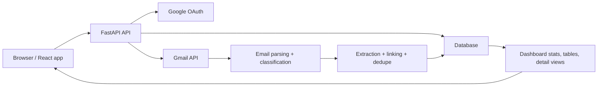

# Project Overview

## 1. Project Background

This repository is a full-stack job application tracking system built around one central idea: turn a messy Gmail inbox into a structured, queryable job-search database.

The project started as a personal email-monitoring workflow and has been expanded into a modular application with:

- a FastAPI backend
- a React dashboard
- Google OAuth authentication
- Gmail API scanning
- a relational database for applications, emails, status history, and scan jobs
- an optional LLM-assisted extraction pipeline

The main product goal is simple: when job-related emails arrive, the system should detect them, understand what they mean, connect them to the right application record, and show the result in a dashboard that is easier to manage than an inbox.

## 2. Tech Stack

- Backend: Python, FastAPI, SQLAlchemy, Pydantic Settings, Structlog
- Frontend: React 18, TypeScript, Vite, Tailwind CSS, Recharts
- Auth and mailbox access: Google OAuth + Gmail REST API
- Database: SQLite locally, Postgres-compatible in production
- AI layer: optional OpenAI-based extraction with rule-based fallback

## 3. High-Level Architecture

The application is organized around three major layers:

1. The frontend handles authentication state, journey selection, dashboard rendering, and user actions.
2. The backend exposes REST APIs for auth, journeys, applications, emails, scans, and stats.
3. The scan pipeline turns raw Gmail messages into `ProcessedEmail`, `Application`, and `StatusHistory` records.

## 4. Core Data Model

The database is the backbone of the project. The important models are:

- `User`: the signed-in person.
- `GoogleAccount`: encrypted Google tokens for mailbox access.
- `AuthSession`: server-side login session stored as a hashed token.
- `Journey`: a scoped job-search workspace for one user.
- `Application`: one tracked job application.
- `ProcessedEmail`: one scanned email, including its extracted metadata and link to an application.
- `StatusHistory`: audit trail of application status changes.
- `ScanState`: the saved Gmail history cursor used for incremental scans.
- `ScanJob`: one resumable scan task.
- `ScanJobMessage`: the queue of Gmail messages inside a scan job.

One important implementation detail is that the backend automatically scopes most reads and writes by `owner_user_id` and `journey_id`. That means the same database can safely hold data for multiple users and multiple journeys without every route manually repeating that filter logic.

## 5. Main Features

| Feature | What it does | Main implementation | How it connects |
| --- | --- | --- | --- |
| Google login | Authenticates the user and connects Gmail access | `backend/job_monitor/auth/*` | Required before scans, journeys, and dashboard data can be used |
| Journey management | Lets one user keep separate job-search workspaces | `api/journeys.py`, `JourneyContext.tsx` | Every scan, application, and stat query is scoped to the active journey |
| Gmail scan jobs | Fetches inbox messages in incremental, full, or date-range mode | `api/scan.py`, `scan_jobs.py`, `ScanButton.tsx` | Drives the whole email-to-application pipeline |
| Email parsing | Decodes MIME content, dates, and body text | `email/parser.py` | Feeds clean text into classification and extraction |
| Email classification | Decides whether an email is job-related | `email/classifier.py`, `extraction/core.py` | Prevents noise from becoming false application records |
| Field extraction | Pulls company, title, req ID, and status from emails | `extraction/core.py`, `extraction/rules.py`, `extraction/llm.py` | Produces the structured fields used to build or update applications |
| Linking and dedupe | Connects emails to existing applications and merges duplicates | `linking/resolver.py`, `dedupe.py`, `extraction/pipeline.py` | Keeps one application from being split into many records |
| Application CRUD | Lets the user create, edit, delete, merge, split, and unmerge records | `api/applications.py`, `ApplicationTable.tsx`, `ApplicationDetail.tsx` | Manual correction layer on top of automatic scanning |
| Manual review queue | Handles ambiguous email-to-application matches | `api/emails.py`, `ReviewQueue.tsx` | Resolves cases where automation is intentionally conservative |
| Dashboard analytics | Shows counts, activity trends, status flow, and LLM cost | `api/stats.py`, chart components | Reads the data produced by scans and manual edits |
| Evaluation toolkit | Supports offline labeling and pipeline scoring | `backend/job_monitor/eval/*`, `frontend/src/pages/eval/*` | Internal quality-improvement system, not currently wired into the live app shell |

## 6. How the Main Product Flow Works

### Step 1: User authentication

The user clicks "Sign in with Google" in the frontend.

The backend then:

- starts the OAuth flow
- validates the callback state
- exchanges the code for Google tokens
- stores encrypted access and refresh tokens
- creates a server-side session
- sets an HttpOnly auth cookie

After that, the frontend uses `/api/auth/me` to restore the logged-in state.

### Step 2: Journey selection

Once the user is authenticated, the app loads the list of journeys and determines the active one.

A journey is effectively a named scope for one job search. This affects:

- which applications are shown
- which emails are considered linked
- which scan jobs are active
- which stats are calculated

This is implemented with two layers:

- frontend state in `JourneyContext.tsx`
- backend scoping in `auth/deps.py` and `database.py`

### Step 3: Scan job creation

When the user starts a scan, the frontend creates or reuses a `ScanJob`.

The scan can run in three modes:

- `incremental`: continue from the saved Gmail history cursor
- `full`: read the full filtered inbox
- `date_range`: read messages inside a specific date range

The backend stores the job and queues each Gmail message ID in `ScanJobMessage`. This makes the scan resumable, cancellable, and trackable.

### Step 4: Gmail message retrieval

The Gmail client fetches message IDs first, then downloads messages in small batches.

Important implementation details:

- it uses the Gmail REST API, not IMAP, in the current production code
- it filters for inbox mail and excludes Social and Promotions
- it tracks Gmail history IDs for efficient incremental scans
- it falls back gracefully if the old Gmail history cursor has expired

### Step 5: Email parsing and cleanup

Each raw message is parsed into a normalized structure:

- decoded subject
- decoded sender
- parsed date
- cleaned body text
- Gmail thread/message IDs when available

The parser also prefers clean plain text over HTML noise and converts dates to the `America/Los_Angeles` timezone.

### Step 6: Classification

The shared extraction core decides whether the email is a trackable job email.

This happens in two stages:

1. Hard negative rules reject obvious non-job mail such as LinkedIn invitations, job recommendation digests, verification emails, and newsletter-style content.
2. If the email survives that filter, the system uses either:
   - LLM-assisted classification and extraction, or
   - rule-based keyword matching and extraction

This shared logic is important because the same core is reused in both production scanning and the evaluation framework.

### Step 7: Extraction

For job-related emails, the system extracts:

- company
- job title
- requisition ID
- application status

The extraction strategy is hybrid:

- if the LLM is enabled and succeeds, its output is used first
- rule-based extraction fills in gaps and acts as fallback
- titles and requisition IDs are normalized before persistence

This is what converts human-written email language into application database fields.

### Step 8: Linking to an application

After extraction, the pipeline decides whether this email belongs to:

- an existing application
- a new application
- an ambiguous case that needs manual review

Current production behavior is conservative:

- company-based linking is active
- same-company plus exact req ID can link directly
- title similarity and status context are used to narrow candidates
- LLM confirmation can be used for ambiguous company matches
- if confidence is not good enough, the email is flagged with `needs_review`

There is one important nuance: the repository still has thread-linking infrastructure, and `ProcessedEmail` stores Gmail thread IDs, but the live production pipeline currently has thread linking disabled because some companies reuse Gmail threads for different positions and that created false merges.

### Step 9: Application persistence and status history

Once linking is resolved, the system either:

- creates a new `Application`, or
- updates an existing one

At the same time it:

- writes or updates the `ProcessedEmail` row
- records `StatusHistory` when status changes
- keeps the latest email subject/sender/date on the application record
- tracks token usage and estimated LLM cost

This is the point where inbox activity becomes dashboard data.

### Step 10: Duplicate cleanup

After scan processing finishes, the system runs owner-level duplicate merging.

It groups candidate duplicates by normalized company plus normalized title and req ID, then:

- keeps the strongest record
- moves emails and history to that record
- deletes the duplicate row
- writes an `ApplicationMergeEvent` and `ApplicationMergeItem` audit trail

This design matters because it also makes later unmerge possible.

## 7. User-Facing Functional Areas

### A. Dashboard

The dashboard is the main operating surface of the app.

It combines:

- filterable application lists
- scan controls
- scan progress and last-result summaries
- a review queue for ambiguous emails
- activity charts
- status flow visualization
- LLM cost history

The main page orchestrates several APIs at once:

- `/api/applications`
- `/api/stats/dashboard`
- `/api/scan/status`
- `/api/scan/last-result`

### B. Application table

The application table supports:

- inline status updates
- row expansion to inspect linked emails
- delete
- merge
- split
- navigation to the detail page

This gives the user a fast cleanup tool after scans complete.

### C. Application detail page

The detail page is the record-level control center.

It shows:

- core application fields
- editable status
- notes
- linked emails in chronological order
- merge history
- unmerge actions
- split flow for moving selected emails into a new application

### D. Review queue

The review queue exists because fully automatic linking would create too many false positives.

When the system sees one company but multiple plausible target applications, it does not guess aggressively. Instead, it surfaces those emails for manual assignment. This is a strong product choice: accuracy is prioritized over over-automation.

## 8. How the Frontend and Backend Are Connected

The frontend is thin by design. Most business logic lives in the backend.

The connection pattern is:

1. Context providers restore auth and journey state.
2. Page components call typed API helpers from `frontend/src/api/client.ts`.
3. The backend returns scoped JSON responses.
4. UI components render tables, charts, and scan progress from those responses.

Examples:

- `AuthContext` depends on `/api/auth/me` and `/api/auth/logout`
- `JourneyContext` depends on `/api/journeys`
- `Dashboard.tsx` depends on application, stats, and scan APIs
- `ScanButton.tsx` opens an SSE stream from scan endpoints
- `ApplicationDetail.tsx` depends on application detail, merge, split, and unmerge APIs

## 9. Evaluation Subsystem

This repository also contains a substantial evaluation framework intended to measure pipeline quality.

Its design includes:

- caching raw emails for repeatable experiments
- human labeling of whether an email is job-related
- labeling of correct company, title, status, and grouping
- replaying the pipeline on cached emails
- scoring classification, extraction, status prediction, and grouping quality

This is valuable because it lets the team improve extraction and linking logic without guessing.

However, based on the current app wiring, this subsystem is not part of the active production shell right now:

- the main FastAPI app does not include the eval router
- the main React router does not include the `/eval` pages

So it should be treated as repository-resident tooling or an in-progress feature, not as a currently exposed end-user feature.

## 10. Current Code Reality vs. Older Documentation

There are a few important code-vs-doc mismatches:

- The README and older planning documents still mention export functionality, but the current FastAPI app does not register an export router and the frontend does not expose export UI.
- Older documents talk about IMAP more heavily, but the active scan implementation now uses the Gmail REST API.
- Evaluation pages and backend code exist in the repository, but they are not mounted in the live app entry points.
- Thread-linking infrastructure still exists, but the production scan pipeline currently does not use it.

## 11. Bottom Line

This project is best understood as a Gmail-native job application operating system:

- authentication connects a mailbox
- journeys define a search scope
- scan jobs ingest emails
- parsing and extraction convert email text into structured fields
- linking and dedupe turn those fields into stable application records
- CRUD and review tools let the user correct edge cases
- the dashboard turns the resulting data into something manageable

The strongest architectural choice in the current codebase is that the backend owns the hard logic and the frontend mostly acts as a control and visualization layer. That keeps the system easier to evolve, test, and eventually deploy across local and production environments.
