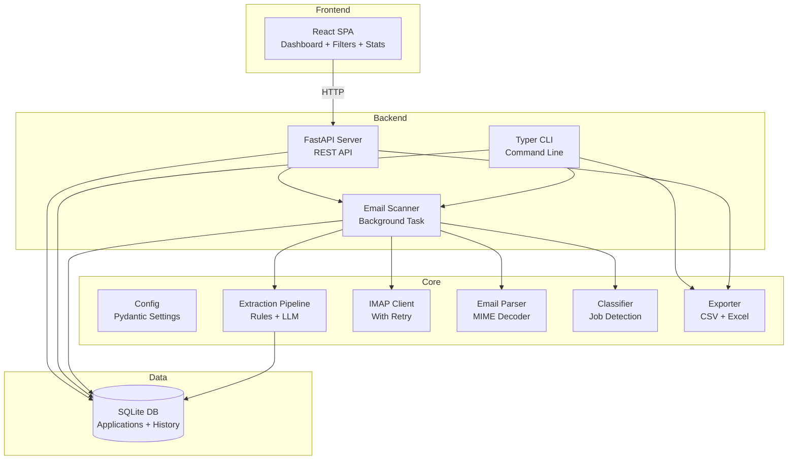
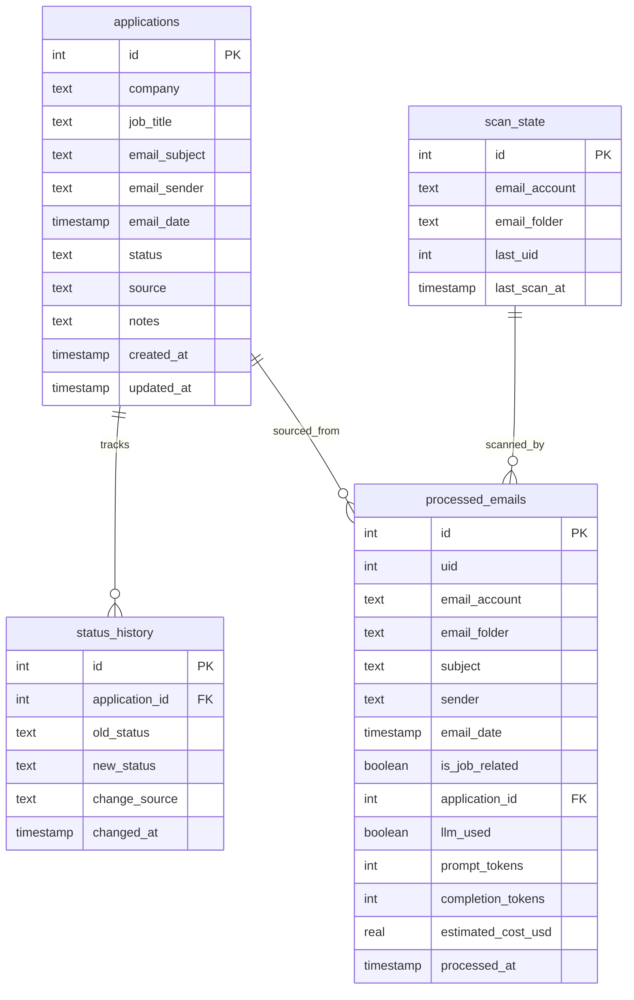
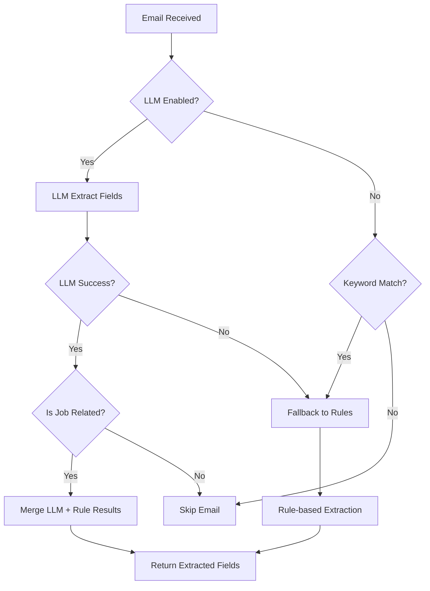
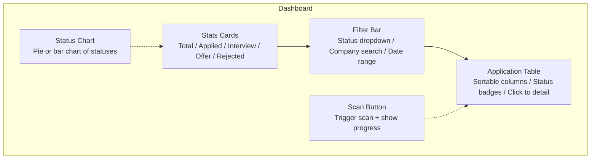
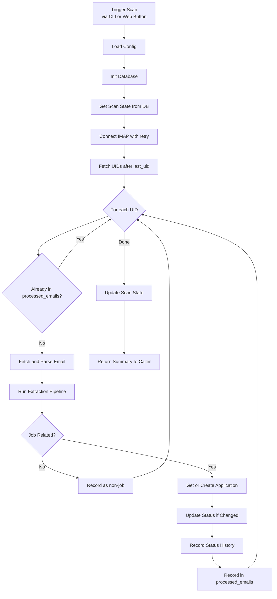

# Job Application Monitor — Production Architecture

## 1. Overview

Transform the current single-file script (`monitor_job_apps.py`, 711 lines) into a modular, testable, cross-platform Python application with a proper database, web dashboard, CLI interface, and clean separation of concerns — while preserving all existing functionality.

### Current State Problems

| Problem | Impact |
|---------|--------|
| Single 711-line monolithic script | Hard to test, maintain, extend |
| macOS-only (Numbers.app via AppleScript) | Not cross-platform |
| `print()` for logging | No log levels, no file logging, no structured output |
| JSON file for state tracking | No duplicate detection, no history, fragile |
| Broad try/except in `main()` | Silent failures, hard to debug |
| No tests | Regressions go undetected |
| No web interface | Can only view data in Numbers spreadsheet |
| Regex-heavy extraction | Fragile, hard to tune |
| No retry logic for IMAP/LLM | Fails on transient network errors |
| Hardcoded LLM provider | Cannot swap to other providers |
| No data export flexibility | Only Numbers format |

### Design Principles

- **MVP-first**: Ship a working personal tool, but design for multi-user expansion
- **Cross-platform**: Drop macOS-only dependencies from the core; keep Numbers export as optional
- **Testable**: Every module independently testable with dependency injection
- **Configurable**: Pydantic-validated configuration, environment-driven
- **Observable**: Structured logging with levels, optional cost tracking
- **Web-native**: Dashboard for viewing and managing applications

---

## 2. System Architecture



---

## 3. Project Structure

```
job-monitor/
├── backend/
│   └── job_monitor/
│       ├── __init__.py
│       ├── main.py                   # FastAPI app entry point
│       ├── config.py                 # Pydantic settings and validation
│       ├── models.py                 # SQLAlchemy ORM models
│       ├── schemas.py                # Pydantic API request/response schemas
│       ├── database.py              # DB engine, session, init
│       ├── api/
│       │   ├── __init__.py
│       │   ├── applications.py      # CRUD endpoints for applications
│       │   ├── scan.py              # Trigger scan endpoint
│       │   ├── stats.py             # Dashboard statistics endpoint
│       │   └── export.py            # Export endpoint (CSV/Excel download)
│       ├── email/
│       │   ├── __init__.py
│       │   ├── client.py            # IMAP client with retry and timeout
│       │   ├── parser.py            # MIME decoding, body extraction
│       │   └── classifier.py        # Keyword-based job classification
│       ├── extraction/
│       │   ├── __init__.py
│       │   ├── rules.py             # Regex-based field extraction
│       │   ├── llm.py               # LLM provider abstraction
│       │   └── pipeline.py          # Orchestrator: rules + LLM fallback
│       ├── export/
│       │   ├── __init__.py
│       │   ├── csv_export.py        # CSV export
│       │   └── excel_export.py      # Excel export via openpyxl
│       ├── cli.py                    # Typer CLI entry point
│       └── logging_config.py        # Structured logging setup
├── frontend/
│   ├── package.json
│   ├── vite.config.ts               # Vite build config
│   ├── tsconfig.json
│   ├── index.html
│   └── src/
│       ├── main.tsx                  # React entry point
│       ├── App.tsx                   # Root component with routing
│       ├── api/
│       │   └── client.ts            # API client (fetch wrapper)
│       ├── components/
│       │   ├── Layout.tsx            # Page layout with nav
│       │   ├── ApplicationTable.tsx  # Main data table with sorting
│       │   ├── StatusBadge.tsx       # Color-coded status badges
│       │   ├── FilterBar.tsx         # Status/company/date filters
│       │   ├── StatsCards.tsx        # Summary stat cards
│       │   ├── StatusChart.tsx       # Status distribution chart
│       │   └── ScanButton.tsx        # Trigger email scan
│       ├── pages/
│       │   ├── Dashboard.tsx         # Main dashboard page
│       │   └── ApplicationDetail.tsx # Single application detail + history
│       ├── types/
│       │   └── index.ts             # TypeScript interfaces
│       └── styles/
│           └── index.css             # Tailwind CSS
├── tests/
│   ├── conftest.py                  # Fixtures: in-memory DB, mock IMAP
│   ├── test_config.py
│   ├── test_email_client.py
│   ├── test_email_parser.py
│   ├── test_classifier.py
│   ├── test_extraction_rules.py
│   ├── test_llm_extraction.py
│   ├── test_pipeline.py
│   ├── test_database.py
│   ├── test_api.py
│   └── test_export.py
├── alembic/                         # Database migrations
│   ├── env.py
│   └── versions/
├── alembic.ini
├── pyproject.toml                   # Python project config
├── Dockerfile
├── docker-compose.yml
├── .env.example
├── .gitignore
├── README.md
└── Makefile
```

---

## 4. Database Schema

SQLite for MVP. Designed to migrate to PostgreSQL with zero code changes via SQLAlchemy.



### Table Details

**`applications`** — One row per unique job application

| Column | Type | Notes |
|--------|------|-------|
| `id` | INTEGER PK | Auto-increment |
| `company` | TEXT NOT NULL | Extracted company name |
| `job_title` | TEXT | Extracted job title |
| `email_subject` | TEXT | Original email subject |
| `email_sender` | TEXT | Sender address |
| `email_date` | TIMESTAMP | Email date in PT |
| `status` | TEXT NOT NULL | 已申请, 面试, 拒绝, Offer, Unknown |
| `source` | TEXT | email / manual |
| `notes` | TEXT | User notes |
| `created_at` | TIMESTAMP | Row creation time |
| `updated_at` | TIMESTAMP | Last update time |

**Unique constraint**: `(company, job_title)` — prevents duplicate entries.

**`status_history`** — Audit trail of status changes

| Column | Type | Notes |
|--------|------|-------|
| `id` | INTEGER PK | Auto-increment |
| `application_id` | INTEGER FK | References applications.id |
| `old_status` | TEXT | Previous status |
| `new_status` | TEXT NOT NULL | New status |
| `change_source` | TEXT | email_uid / manual / llm |
| `changed_at` | TIMESTAMP | When the change occurred |

**`processed_emails`** — Every email scanned

| Column | Type | Notes |
|--------|------|-------|
| `id` | INTEGER PK | Auto-increment |
| `uid` | INTEGER NOT NULL | IMAP UID |
| `email_account` | TEXT NOT NULL | Which account |
| `email_folder` | TEXT | INBOX, etc. |
| `subject` | TEXT | Email subject |
| `sender` | TEXT | Sender |
| `email_date` | TIMESTAMP | Email date |
| `is_job_related` | BOOLEAN | Classification result |
| `application_id` | INTEGER FK | Linked application |
| `llm_used` | BOOLEAN | Whether LLM was used |
| `prompt_tokens` | INTEGER | LLM prompt tokens |
| `completion_tokens` | INTEGER | LLM completion tokens |
| `estimated_cost_usd` | REAL | Estimated LLM cost |
| `processed_at` | TIMESTAMP | When processed |

**Unique constraint**: `(uid, email_account, email_folder)` — prevents re-processing.

**`scan_state`** — Replaces `.job_monitor_state.json`

| Column | Type | Notes |
|--------|------|-------|
| `id` | INTEGER PK | Auto-increment |
| `email_account` | TEXT NOT NULL | Account identifier |
| `email_folder` | TEXT | Folder name |
| `last_uid` | INTEGER | Last processed UID |
| `last_scan_at` | TIMESTAMP | When last scan ran |

**Unique constraint**: `(email_account, email_folder)`.

---

## 5. Backend Module Design

### 5.1 Configuration — `config.py`

Pydantic Settings replaces manual `os.getenv()`:

```python
class AppConfig(BaseSettings):
    # IMAP
    imap_host: str
    imap_port: int = 993
    email_username: str
    email_password: SecretStr
    email_folder: str = "INBOX"
    # Database
    database_url: str = "sqlite:///job_monitor.db"
    # Scanning
    max_scan_emails: int = 20
    imap_timeout_sec: int = 30
    # LLM
    llm_enabled: bool = True
    llm_provider: str = "openai"
    llm_model: str = "gpt-4o-mini"
    llm_api_key: SecretStr = ""
    llm_timeout_sec: int = 45
    # Server
    host: str = "0.0.0.0"
    port: int = 8000
    # Logging
    log_level: str = "INFO"
```

### 5.2 FastAPI Server — `main.py`

```
FastAPI App
├── /api/applications      # CRUD for applications
├── /api/applications/{id} # Single application + history
├── /api/scan              # Trigger email scan
├── /api/stats             # Dashboard statistics
├── /api/export            # Download CSV/Excel
└── CORS middleware         # Allow React frontend
```

### 5.3 API Endpoints — `api/`

**`api/applications.py`**
| Method | Path | Description |
|--------|------|-------------|
| GET | `/api/applications` | List all (with filters: status, company, date range) |
| GET | `/api/applications/{id}` | Get one application + status history |
| POST | `/api/applications` | Manually add an application |
| PATCH | `/api/applications/{id}` | Update status or notes |
| DELETE | `/api/applications/{id}` | Delete an application |

**`api/scan.py`**
| Method | Path | Description |
|--------|------|-------------|
| POST | `/api/scan` | Trigger an email scan |
| GET | `/api/scan/status` | Get last scan info |

**`api/stats.py`**
| Method | Path | Description |
|--------|------|-------------|
| GET | `/api/stats` | Return counts by status, recent activity, LLM cost totals |

**`api/export.py`**
| Method | Path | Description |
|--------|------|-------------|
| GET | `/api/export?format=csv` | Download CSV |
| GET | `/api/export?format=excel` | Download Excel |

### 5.4 Email Client — `email/client.py`

IMAP connection with **tenacity** retry:
- Retry on transient `IMAP4.error` and `socket.timeout` (3 retries, exponential backoff)
- Configurable timeout
- Context manager for proper cleanup

### 5.5 Email Parser — `email/parser.py`

Extracted from current functions:
- `decode_mime_text()` — MIME header decoding
- `extract_body_text()` — multipart body extraction
- `is_noise_text()` — CSS/HTML junk detection

### 5.6 Classifier — `email/classifier.py`

- `is_job_related(subject, sender)` — keyword-based detection
- Configurable keyword lists

### 5.7 Extraction Rules — `extraction/rules.py`

All existing regex patterns, organized:
- `extract_company(subject, sender)` — company name extraction
- `extract_job_title(subject, body)` — job title extraction
- `extract_status(subject, body)` — status inference

### 5.8 LLM Provider — `extraction/llm.py`

Protocol-based abstraction for swappable LLM backends:

```
LLMProvider (Protocol)
├── extract_fields(sender, subject, body) -> ExtractionResult

OpenAIProvider(LLMProvider)     # Current implementation
# Future:
AnthropicProvider(LLMProvider)
OllamaProvider(LLMProvider)
```

### 5.9 Extraction Pipeline — `extraction/pipeline.py`

Orchestrates rules + LLM:



### 5.10 CLI — `cli.py`

Typer-based CLI with subcommands (also available alongside the web server):

```bash
job-monitor scan                    # Scan emails
job-monitor list                    # List applications
job-monitor export --format csv     # Export data
job-monitor serve                   # Start web server
job-monitor init                    # Initialize database
job-monitor migrate                 # Migrate from old format
```

---

## 6. Frontend Design (React + Vite + Tailwind)

### 6.1 Tech Stack

| Tool | Purpose |
|------|---------|
| **React 18** | UI framework |
| **TypeScript** | Type safety |
| **Vite** | Fast dev server + build |
| **Tailwind CSS** | Utility-first styling |
| **React Router** | Page routing |
| **TanStack Table** | Sortable/filterable data table |
| **Recharts** | Simple charts for stats |

### 6.2 Pages and Components

**Dashboard Page** — Main view at `/`



**Stats Cards**: Show at-a-glance numbers
- Total Applications
- By Status: 已申请 / 面试 / Offer / 拒绝

**Filter Bar**: 
- Status dropdown filter
- Company name search
- Date range picker

**Application Table** columns:
| Column | Features |
|--------|----------|
| Company | Sortable, searchable |
| Job Title | Sortable |
| Status | Color-coded badge (green=Offer, blue=面试, gray=已申请, red=拒绝) |
| Date | Sortable, formatted to PT |
| Email Subject | Truncated with tooltip |
| Actions | Edit status, view detail, delete |

**Application Detail Page** — at `/applications/{id}`
- Full application info
- Status history timeline
- Edit status / add notes
- Related processed emails

### 6.3 UI Wireframe

```
┌──────────────────────────────────────────────────────────┐
│  Job Application Monitor                    [Scan Now]   │
├──────────────────────────────────────────────────────────┤
│                                                          │
│  ┌──────┐  ┌──────┐  ┌──────┐  ┌──────┐  ┌──────┐     │
│  │  42  │  │  28  │  │   8  │  │   3  │  │   3  │     │
│  │Total │  │已申请│  │ 面试 │  │Offer │  │ 拒绝 │     │
│  └──────┘  └──────┘  └──────┘  └──────┘  └──────┘     │
│                                                          │
│  Status: [All ▼]  Company: [________]  Date: [__ to __] │
│                                                          │
│  ┌──────────┬──────────┬────────┬────────┬────────────┐ │
│  │ Company  │Job Title │ Status │  Date  │  Actions   │ │
│  ├──────────┼──────────┼────────┼────────┼────────────┤ │
│  │ Google   │ SWE III  │ 🟢 面试│ 02-15  │ ✏️  🗑️     │ │
│  │ Meta     │ MLE      │ ⚪ 已申请│ 02-14  │ ✏️  🗑️     │ │
│  │ Amazon   │ SDE II   │ 🔴 拒绝│ 02-12  │ ✏️  🗑️     │ │
│  │ Stripe   │ Backend  │ 🟢 Offer│ 02-10  │ ✏️  🗑️     │ │
│  └──────────┴──────────┴────────┴────────┴────────────┘ │
│                                                          │
│  [< 1 2 3 >]                          [Export CSV ▼]    │
└──────────────────────────────────────────────────────────┘
```

---

## 7. Data Flow — Main Scan Workflow



---

## 8. Technology Stack

| Component | Current | Proposed | Rationale |
|-----------|---------|----------|-----------|
| Config | `os.getenv()` | **pydantic-settings** | Validation, types, .env loading |
| Database | JSON + Numbers.app | **SQLAlchemy + SQLite** | Cross-platform, queryable, migratable |
| Migrations | None | **Alembic** | Schema versioning |
| Backend API | None | **FastAPI** | Async, auto-docs, Pydantic integration |
| Frontend | None | **React + Vite + Tailwind** | Modern, fast, lightweight |
| CLI | `if __name__` | **Typer** | Subcommands, help, shell completion |
| Logging | `print()` | **structlog** | Levels, structured JSON output |
| Retry | None | **tenacity** | IMAP/LLM transient failure recovery |
| LLM | OpenAI hardcoded | **Provider protocol** | Swappable backends |
| Export | Numbers only | **openpyxl + csv** | Cross-platform |
| Testing | None | **pytest + httpx** | Unit + API integration tests |
| Linting | None | **ruff** | Fast linting + formatting |
| Packaging | requirements.txt | **pyproject.toml** | Modern Python packaging |
| Containers | None | **Docker + compose** | Reproducible deployment |

---

## 9. Migration Strategy

One-time migration from current system:

1. **Export Numbers data** — Read `job_application_tracker.numbers` → CSV
2. **Import into SQLite** — Populate `applications` table
3. **Transfer state** — Read `.job_monitor_state.json` → `scan_state` table
4. **CLI command** — `job-monitor migrate` automates this

---

## 10. Implementation Phases

### Phase 1: Foundation
- Project structure with `pyproject.toml` and Makefile
- `config.py` with Pydantic settings
- `database.py` + `models.py` with SQLAlchemy ORM
- Alembic migration setup
- `logging_config.py` with structlog
- Tests for config and database

### Phase 2: Core Email Pipeline
- `email/parser.py` — extracted from existing code
- `email/classifier.py` — extracted from existing code
- `email/client.py` — IMAP with tenacity retry
- Tests for parser, classifier, client

### Phase 3: Extraction Engine
- `extraction/rules.py` — existing regex patterns refactored
- `extraction/llm.py` — OpenAI provider with protocol abstraction
- `extraction/pipeline.py` — orchestrator
- Tests for all extraction modules

### Phase 4: FastAPI Backend
- `main.py` — FastAPI app with CORS
- `schemas.py` — Pydantic request/response models
- `api/applications.py` — CRUD endpoints
- `api/scan.py` — trigger scan endpoint
- `api/stats.py` — statistics endpoint
- `api/export.py` — CSV/Excel download
- API tests with httpx

### Phase 5: React Frontend
- Vite + React + TypeScript + Tailwind setup
- API client module
- Dashboard page with stats cards
- Application table with sorting and filtering
- Filter bar component
- Status badges and chart
- Application detail page with history
- Scan button with progress feedback
- Export button

### Phase 6: CLI and Export
- `cli.py` with Typer — scan, list, export, serve, init, migrate
- `export/csv_export.py` and `export/excel_export.py`
- Tests for CLI and export

### Phase 7: Polish and Deploy
- Dockerfile + docker-compose.yml (backend + frontend + SQLite volume)
- `.gitignore` and comprehensive `README.md`
- Ruff linting configuration
- Migration command for existing data
- End-to-end integration tests
