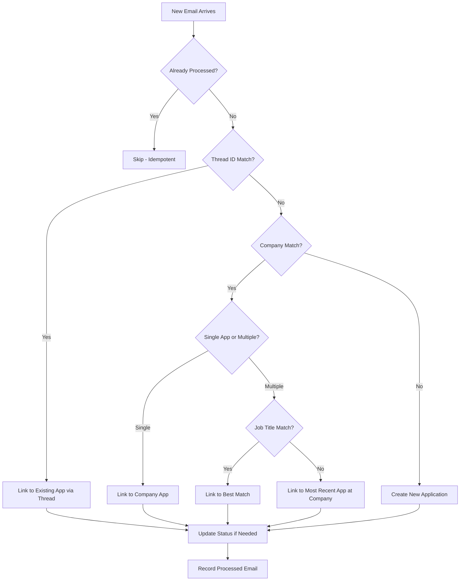

# Comprehensive Email Linking Strategy

## Problem Statement

Job application emails come from multiple sources with different threading patterns:
1. **LinkedIn/Indeed confirmations** - Sent from job platform, separate thread
2. **Company ATS confirmations** - Sent from company's Workday/Lever/etc
3. **Recruiter updates** - May be replies or new threads
4. **Rejection/Offer emails** - Often new threads from company directly

Current thread-based linking only works when emails are in the same Gmail conversation (same X-GM-THRID). This fails when:
- Application via LinkedIn → Rejection from company directly
- Different recruiters send from different email threads
- Company uses different ATS systems for different stages

## Multi-Tier Linking Strategy



## Tier 1: Thread ID Match - Exact Match

**Already Implemented ✓**

- Match by `gmail_thread_id` - same Gmail conversation
- Emails are definitely related if they share thread ID
- Works for direct replies

## Tier 2: Company Name Match

**When to Use:** Thread ID doesn't match any existing application

**Strategy:**
1. Extract company name from new email (already done by LLM/rules)
2. Normalize company name for comparison
3. Find existing applications with matching normalized company
4. If exactly one match → link to it
5. If multiple matches → go to Tier 3

**Normalization Function:**
```python
def normalize_company(name: str) -> str:
    name = name.lower().strip()
    # Remove legal suffixes
    suffixes = [', inc.', ' inc.', ' inc', ', llc', ' llc', 
                ', corp.', ' corp.', ' corp', ', ltd', ' ltd',
                ', gmbh', ' gmbh', ' limited']
    for suffix in suffixes:
        if name.endswith(suffix):
            name = name[:-len(suffix)]
    return name.strip()

# Examples:
# "Tesla, Inc." → "tesla"
# "Meta Platforms" → "meta platforms"
# "WPROMOTE" → "wpromote"
```

## Tier 3: Job Title Similarity

**When to Use:** Multiple applications exist at the same company

**Strategy:**
1. Extract job title from new email
2. Compare with job titles of all applications at that company
3. Use word overlap to find best match
4. Link to application with best matching title

**Matching Logic:**
```python
def title_matches(title1: str, title2: str) -> bool:
    words1 = set(title1.lower().split())
    words2 = set(title2.lower().split())
    
    # Check for key role words overlap
    role_words = {'engineer', 'developer', 'analyst', 'scientist', 
                  'manager', 'lead', 'senior', 'junior', 'staff', 'data'}
    
    common_roles = (words1 & role_words) & (words2 & role_words)
    common_all = words1 & words2
    
    # Match if share at least one role word AND some other common word
    return len(common_roles) > 0 and len(common_all) >= 2
```

## Tier 4: Fallback - Most Recent at Company

**When to Use:** Company matches but can't determine specific position

**Strategy:**
- Link to the most recently created application at that company
- Assumption: rejection/update is likely for the most recent application

## Tier 5: Manual Linking - User Override

**When Automatic Linking Fails or is Wrong:**

**UI Features Needed:**
1. **Link Email** - Select a different application to link this email to
2. **Unlink Email** - Remove email from current application  
3. **Merge Applications** - Combine two duplicate applications into one

## Implementation Plan

### Phase 1: Company-Based Linking (Backend)
- [ ] Add `normalized_company` column to applications table
- [ ] Create company normalization utility function
- [ ] Add `resolve_by_company()` function in linking/resolver.py
- [ ] Update pipeline to try company match after thread match fails
- [ ] Add `link_method` column to track how email was linked

### Phase 2: Job Title Matching (Backend)
- [ ] Implement `title_matches()` function
- [ ] Integrate into company linking when multiple apps exist
- [ ] Test with real data

### Phase 3: Manual Linking (API + UI)
- [ ] Add `PATCH /api/emails/{id}/link` endpoint
- [ ] Add `POST /api/applications/{id}/merge` endpoint
- [ ] Add link management buttons in ApplicationDetail page
- [ ] Add merge functionality

## Data Model Changes

```sql
-- Add to applications table
ALTER TABLE applications ADD COLUMN normalized_company VARCHAR(200);
CREATE INDEX idx_applications_normalized_company ON applications(normalized_company);

-- Add to processed_emails table
ALTER TABLE processed_emails ADD COLUMN link_method VARCHAR(20) DEFAULT 'thread';
-- Values: 'thread', 'company', 'title', 'manual', 'new'
```

## Testing Scenarios

| Scenario | Expected Behavior |
|----------|-------------------|
| Same thread emails | Link via thread_id |
| LinkedIn apply + Company rejection | Link via company name |
| Multiple positions at same company | Link via job title match |
| Completely new company email | Create new application |
| User manually re-links | Override automatic link |

## Example: Wpromote Case

**Current Broken Flow:**
1. Apply via LinkedIn → Email from `jobs-noreply@linkedin.com` with subject "your application was sent to Wpromote"
2. System creates Application: company="Wpromote", thread_id=A
3. Rejection from `no-reply@hire.lever.co` with subject "Thank you for your interest in Wpromote!"
4. Different thread_id=B, so system creates NEW application ❌

**Fixed Flow with Company Linking:**
1. Same as above - Application created for Wpromote
2. Rejection email arrives with thread_id=B (no match)
3. System extracts company="Wpromote" from email
4. Finds existing Wpromote application
5. Links rejection email to existing application ✓
6. Updates status to "拒绝" ✓
