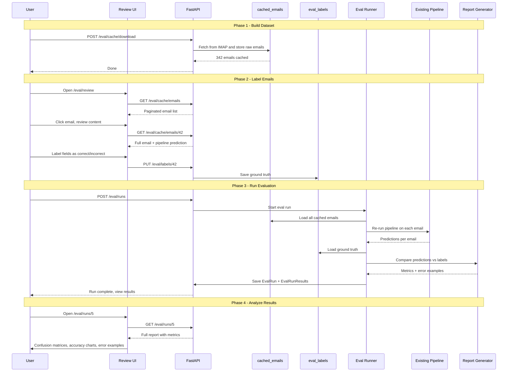

# Evaluation & Testing Framework for Job Application Email Pipeline

## 1. Overview

Build a comprehensive evaluation system with three major components:

1. **Local Email Cache** — Download and store raw emails locally so the pipeline can be re-run without hitting IMAP
2. **Multi-Stage Evaluation Engine** — Measure accuracy at each pipeline step independently
3. **Web-Based Review UI** — Separate route within the existing React app for human-in-the-loop labeling and accuracy reporting

### Architecture Decision: Integrated vs. Separate UI

**Recommendation: Add as `/eval` routes within the existing React frontend.**

| Factor | Integrated Route | Separate App |
|--------|-----------------|--------------|
| Shared types/API client | Reuses existing `types/index.ts` and `api/client.ts` | Must duplicate or share via package |
| Build complexity | Zero — same Vite build | Separate `package.json`, build, dev server |
| Backend coupling | Same FastAPI server, same models | Would need CORS config for second origin |
| Deployment | Single deploy | Two deploys |
| Isolation | Route-level separation is sufficient | Overkill for a single-user dev tool |

The evaluation UI shares the same data models, API patterns, and Tailwind styling. A separate route with its own layout component provides enough separation.

---

## 2. System Architecture

```mermaid
flowchart TB
    subgraph Email Cache Layer
        IMAP_DL[IMAP Downloader<br/>One-time fetch]
        CACHE_DB[(cached_emails table<br/>raw RFC822 + metadata)]
    end

    subgraph Evaluation Engine
        RUNNER[Eval Runner<br/>Re-run pipeline on cached emails]
        CLASS_EVAL[Classification Evaluator<br/>TP/FP/TN/FN]
        FIELD_EVAL[Field Extraction Evaluator<br/>Per-field accuracy]
        STATUS_EVAL[Status Detection Evaluator<br/>Confusion matrix]
        GROUP_EVAL[Grouping Evaluator<br/>Cluster metrics]
        REPORT[Report Generator<br/>JSON + summary stats]
    end

    subgraph Human Labels
        LABEL_DB[(eval_labels table<br/>Ground truth annotations)]
    end

    subgraph Review UI - React Routes
        QUEUE[/eval/review<br/>Email review queue]
        DETAIL[/eval/review/:id<br/>Label single email]
        DASH[/eval/dashboard<br/>Accuracy metrics + charts]
        RUNS[/eval/runs<br/>Historical eval runs]
    end

    IMAP_DL --> CACHE_DB
    CACHE_DB --> RUNNER
    RUNNER --> CLASS_EVAL
    RUNNER --> FIELD_EVAL
    RUNNER --> STATUS_EVAL
    RUNNER --> GROUP_EVAL
    CLASS_EVAL --> REPORT
    FIELD_EVAL --> REPORT
    STATUS_EVAL --> REPORT
    GROUP_EVAL --> REPORT
    LABEL_DB --> CLASS_EVAL
    LABEL_DB --> FIELD_EVAL
    LABEL_DB --> STATUS_EVAL
    LABEL_DB --> GROUP_EVAL
    REPORT --> DASH
    REPORT --> RUNS
    CACHE_DB --> QUEUE
    LABEL_DB --> QUEUE
    LABEL_DB --> DETAIL
```

---

## 3. Local Email Cache Layer

### 3.1 New Database Table: `cached_emails`

Store the raw RFC822 bytes and parsed metadata so emails can be replayed through the pipeline without IMAP access.

```python
class CachedEmail(Base):
    __tablename__ = "cached_emails"
    
    id: int                    # PK
    uid: int                   # IMAP UID
    email_account: str         # Which account fetched from
    email_folder: str          # INBOX, etc.
    gmail_message_id: str      # Message-ID header (unique)
    gmail_thread_id: str|None  # X-GM-THRID
    subject: str|None          # Decoded subject
    sender: str|None           # Decoded From
    email_date: datetime|None  # Parsed date
    raw_rfc822: bytes          # Full raw email bytes (BLOB)
    body_text: str|None        # Pre-extracted body text
    fetched_at: datetime       # When downloaded
```

**Key design points:**
- `raw_rfc822` stores the complete email so `parse_email_message()` can re-parse it identically
- `body_text` is cached for quick display in the review UI without re-parsing
- Unique constraint on `gmail_message_id` prevents duplicates
- The BLOB column means the SQLite DB will grow — for ~1000 emails at ~50KB avg, that is ~50MB which is fine

### 3.2 Download Command

A new API endpoint `POST /api/eval/cache/download` and a CLI command that:

1. Connects to IMAP using existing `IMAPClient`
2. Fetches emails by date range or UID range
3. For each email, stores the raw RFC822 bytes + parsed metadata in `cached_emails`
4. Skips emails already cached (by `gmail_message_id`)
5. Returns count of new emails cached

### 3.3 Cache-Based Pipeline Runner

A new function `run_pipeline_on_cached_emails()` that:

1. Reads `CachedEmail` records from the database
2. Re-parses each via `email_lib.message_from_bytes()` + `parse_email_message()`
3. Runs the same `_process_single_email()` logic but writes results to eval tables instead of production tables
4. Returns structured results for each email that can be compared against labels

---

## 4. Evaluation Data Model

### 4.1 Ground Truth Labels: `eval_labels`

```python
class EvalLabel(Base):
    __tablename__ = "eval_labels"
    
    id: int                       # PK
    cached_email_id: int          # FK -> cached_emails.id
    
    # Classification label
    is_job_related: bool|None     # True/False/None=unlabeled
    
    # Field extraction labels (None = unlabeled)
    correct_company: str|None
    correct_job_title: str|None
    correct_status: str|None
    correct_recruiter_name: str|None
    correct_date_applied: str|None
    
    # Grouping label
    correct_application_group: str|None  # A group ID string — emails with same value belong together
    
    # Review metadata
    labeler: str                  # Who labeled it
    labeled_at: datetime|None
    notes: str|None               # Free-text notes about this email
    review_status: str            # "unlabeled", "labeled", "skipped", "uncertain"
```

### 4.2 Application Groups: `eval_application_groups`

Named groups that represent a single real-world job application. Emails are assigned to groups during labeling.

```python
class EvalApplicationGroup(Base):
    __tablename__ = "eval_application_groups"
    
    id: int                       # PK, auto-increment
    name: str                     # Display name, e.g. "Google — SWE L5 (Jan 2026)"
    company: str|None             # Company for this application
    job_title: str|None           # Job title for this application
    notes: str|None               # Optional description
    created_at: datetime
    
    # Populated dynamically: count of emails assigned to this group
```

The `EvalLabel.correct_application_group` field stores the `eval_application_groups.id` as a foreign key. This ensures all group assignment is done by selecting from a managed list rather than typing arbitrary strings.

### 4.3 Pipeline Run Results: `eval_runs` + `eval_run_results`

```python
class EvalRun(Base):
    __tablename__ = "eval_runs"
    
    id: int
    run_name: str|None           # Optional human-readable name
    started_at: datetime
    completed_at: datetime|None
    config_snapshot: str          # JSON of pipeline config at run time
    total_emails: int
    labeled_emails: int          # How many had ground truth
    
    # Aggregate metrics (computed after run)
    classification_accuracy: float|None
    classification_precision: float|None
    classification_recall: float|None
    classification_f1: float|None
    field_extraction_accuracy: float|None
    status_detection_accuracy: float|None
    grouping_accuracy: float|None
    
    report_json: str|None         # Full detailed report as JSON


class EvalRunResult(Base):
    __tablename__ = "eval_run_results"
    
    id: int
    eval_run_id: int              # FK -> eval_runs.id
    cached_email_id: int          # FK -> cached_emails.id
    
    # Pipeline outputs
    predicted_is_job_related: bool
    predicted_company: str|None
    predicted_job_title: str|None
    predicted_status: str|None
    predicted_application_group: int|None  # Which app ID the pipeline assigned
    
    # Per-field correctness (computed by comparing to eval_labels)
    classification_correct: bool|None
    company_correct: bool|None     # exact match
    company_partial: bool|None     # fuzzy/normalized match
    job_title_correct: bool|None
    status_correct: bool|None
    grouping_correct: bool|None
    
    # LLM usage for this email
    llm_used: bool
    prompt_tokens: int
    completion_tokens: int
    estimated_cost_usd: float
```

---

## 5. Multi-Stage Evaluation Metrics

### 5.1 Classification Accuracy

Compare `predicted_is_job_related` vs `eval_labels.is_job_related`:

| Metric | Formula |
|--------|---------|
| Accuracy | correct / total_labeled |
| Precision | TP / (TP + FP) |
| Recall | TP / (TP + FN) |
| F1 | 2 * P * R / (P + R) |

Also generate a 2x2 confusion matrix and list specific FP/FN examples.

### 5.2 Field Extraction Accuracy

For each field (company, job_title, status, recruiter), compare predicted vs ground truth:

- **Exact match**: `normalize(predicted) == normalize(ground_truth)` 
- **Partial match**: fuzzy string similarity > 0.8 (e.g., "Meta Platforms" vs "Meta")
- **Wrong**: Neither exact nor partial match
- **Missing**: Pipeline returned empty but ground truth has a value

Report per-field:
- Exact accuracy, partial accuracy, miss rate
- Most common errors (predicted → actual) as a frequency table

### 5.3 Status Detection Accuracy

Status is a categorical variable with known classes: `已申请`, `面试`, `拒绝`, `Offer`, `Unknown`.

Generate:
- Per-class precision, recall, F1
- Full NxN confusion matrix
- List of misclassified examples per cell

### 5.4 Grouping / Deduplication Accuracy

The grouping evaluator treats this as a pure clustering comparison problem with no assumptions about company names or other heuristics:

- **True group** (`correct_application_group` in `eval_labels`) = the actual application instance that the email belongs to. Each unique application (e.g., "Google SWE Jan 2026" vs "Google PM Mar 2026") gets a distinct group label assigned during human review.
- **Predicted group** = whatever application ID the pipeline assigns (the `application_id` in `eval_run_results`).

Metrics computed by comparing these two clusterings:

- **Adjusted Rand Index (ARI)** — measures overall agreement between true and predicted clusterings, adjusted for chance (1.0 = perfect, 0.0 = random)
- **Homogeneity** — each predicted cluster contains only members of a single true group (penalizes merge errors)
- **Completeness** — all members of a true group are assigned to the same predicted cluster (penalizes split errors)
- **Split errors**: One true application instance was fragmented into multiple predicted groups. Report: which true group, how many predicted groups, which emails ended up where.
- **Merge errors**: Two or more distinct application instances were collapsed into a single predicted group. Report: which predicted group, which true groups were merged, which emails.
- **V-measure** — harmonic mean of homogeneity and completeness (single summary score)
- List specific split/merge error examples with email subjects and true/predicted group IDs

---

## 6. Review UI Design

### 6.1 Routes

| Route | Purpose |
|-------|---------|
| `/eval` | Eval dashboard — summary metrics, recent runs, quick stats |
| `/eval/review` | Review queue — list of cached emails with label status, filters |
| `/eval/review/:id` | Label a single email — see raw content, pipeline output, edit labels |
| `/eval/runs` | Historical eval runs — compare accuracy across runs |
| `/eval/runs/:id` | Single run detail — per-stage metrics, confusion matrices, error examples |

### 6.2 Review Queue Page (`/eval/review`)

- Table of cached emails: subject, sender, date, label status badge
- Filters: unlabeled / labeled / all, date range, search
- Bulk actions: mark as non-job, skip
- Sort by: date, label status, pipeline confidence
- Shows pipeline prediction alongside each row for quick comparison

### 6.3 Single Email Review Page (`/eval/review/:id`)

Three-column split-panel layout:

#### Left Column: Source Email (read-only)
- Email subject line (prominent heading)
- Sender address + date
- Full email body text (scrollable, preserving formatting)
- Raw metadata expandable section (Message-ID, Thread-ID, UID)

#### Middle Column: Pipeline Predictions (read-only)
- `is_job_related`: badge (Yes/No)
- `company`: text
- `job_title`: text
- `status`: badge with status color
- `application_group`: link to application record (ID + company + title)
- `confidence`: score
- `llm_used`: badge
- Each field has a subtle background color

#### Right Column: Ground Truth Labels (editable form)
Every field uses **dropdown selectors** populated from existing data — no free-text typing required:

- **Is Job Related**: Toggle switch (Yes / No / Unlabeled)
- **Correct Company**: Searchable dropdown populated from:
  - All distinct companies in `applications` table
  - All distinct `correct_company` values from existing `eval_labels`
  - The pipeline's predicted company (pre-selected if no label exists)
  - Option to type a new value if none match (autocomplete-style)
- **Correct Job Title**: Searchable dropdown populated from:
  - All distinct job titles in `applications` table
  - All distinct `correct_job_title` values from existing `eval_labels`
  - The pipeline's predicted title
  - Option to type a new value
- **Correct Status**: Dropdown with fixed options: `已申请`, `面试`, `拒绝`, `Offer`, `Unknown`
  - Pipeline's predicted status is pre-selected if no label exists
- **Application Group**: Special selector with two modes:
  - **Pick existing group**: Searchable dropdown listing all existing application groups with format `[Group ID] Company — Job Title (N emails)`. Sources:
    - All groups from `eval_labels.correct_application_group` with their associated company/title
    - All `Application` records from the production database
  - **Create new group**: Inline button "＋ New Group" that creates a new group ID and assigns this email to it. The group inherits the company + title from the current label values.
  - All group assignment is done via selection, never free-text input for the group ID itself
- **Notes**: Free-text textarea for reviewer comments

#### Visual Diff Highlighting
Side-by-side comparison between middle column (prediction) and right column (ground truth):
- **Match**: Green left border on the prediction field — pipeline got it right
- **Mismatch**: Red/orange left border + light red background on the prediction field — pipeline got it wrong
- **Unlabeled**: Gray/neutral border — no ground truth yet, no comparison possible
- Discrepancy count badge at the top: "3 of 5 fields differ"

#### Navigation Controls
- **Save** button (Cmd+S shortcut) — persists current labels to `eval_labels`
- **Save & Next** button (Cmd+Enter shortcut) — save and advance to next email
- **← Previous / Next →** buttons for sequential navigation
- **Skip** button — mark as "skipped" and advance
- Progress indicator: "Email 42 of 342 (87 labeled, 12 skipped)"
- Keyboard shortcuts for all actions displayed in a tooltip

### 6.4 Eval Dashboard (`/eval`)

- Cards: total cached emails, labeled count, unlabeled count, label coverage %
- Per-stage accuracy gauges (classification, field extraction, status, grouping)
- Button: "Run Evaluation" to trigger a new eval run
- Recent runs table with accuracy trend sparklines

### 6.5 Run Detail Page (`/eval/runs/:id`)

- Classification: confusion matrix heatmap, precision/recall/F1 cards
- Field extraction: per-field accuracy bar chart, error frequency tables
- Status detection: NxN confusion matrix, per-class metrics
- Grouping: ARI score, split/merge error counts, specific examples
- "Error Examples" expandable sections showing the email content + what went wrong

---

## 7. Backend API Endpoints

All under `/api/eval/` prefix:

### Cache Management
- `POST /api/eval/cache/download` — Fetch emails from IMAP and cache locally
  - Body: `{ since_date?, before_date?, max_count? }`
- `GET /api/eval/cache/stats` — Cache statistics
- `GET /api/eval/cache/emails` — Paginated list of cached emails
- `GET /api/eval/cache/emails/:id` — Single cached email with body

### Labeling
- `GET /api/eval/labels` — All labels (with join to cached_emails)
- `GET /api/eval/labels/:cached_email_id` — Label for a specific email
- `PUT /api/eval/labels/:cached_email_id` — Create or update a label
- `POST /api/eval/labels/bulk` — Bulk update labels

### Application Groups
- `GET /api/eval/groups` — List all application groups with email counts
- `POST /api/eval/groups` — Create a new application group
  - Body: `{ company?, job_title?, name?, notes? }`
- `PUT /api/eval/groups/:id` — Update a group
- `DELETE /api/eval/groups/:id` — Delete a group (unlinks emails)

### Dropdown Data (for review UI selectors)
- `GET /api/eval/dropdown/companies` — Distinct companies from `applications` + `eval_labels`
- `GET /api/eval/dropdown/job-titles` — Distinct job titles from `applications` + `eval_labels`
- `GET /api/eval/dropdown/statuses` — Fixed list of valid statuses

### Evaluation Runs
- `POST /api/eval/runs` — Trigger a new eval run
  - Body: `{ name?, filter? }` — optional name and email filter criteria
- `GET /api/eval/runs` — List all runs
- `GET /api/eval/runs/:id` — Full run detail with metrics and report
- `GET /api/eval/runs/:id/errors` — Error examples for a run
- `DELETE /api/eval/runs/:id` — Delete a run

---

## 8. Project Structure Changes

```
backend/job_monitor/
├── eval/                          # NEW — evaluation module
│   ├── __init__.py
│   ├── models.py                  # CachedEmail, EvalLabel, EvalRun, EvalRunResult
│   ├── schemas.py                 # Pydantic schemas for eval API
│   ├── cache.py                   # Email download + cache logic
│   ├── runner.py                  # Pipeline runner on cached emails
│   ├── metrics.py                 # Accuracy calculation, confusion matrices
│   ├── report.py                  # Report generation (JSON structure)
│   └── api.py                     # FastAPI router for /api/eval/*
├── ...existing modules unchanged

frontend/src/
├── pages/
│   ├── eval/                      # NEW — evaluation pages
│   │   ├── EvalDashboard.tsx      # /eval — summary metrics
│   │   ├── ReviewQueue.tsx        # /eval/review — email list
│   │   ├── ReviewEmail.tsx        # /eval/review/:id — label one email
│   │   ├── EvalRuns.tsx           # /eval/runs — run history
│   │   └── RunDetail.tsx          # /eval/runs/:id — run detail
├── components/
│   ├── eval/                      # NEW — eval-specific components
│   │   ├── ConfusionMatrix.tsx    # Heatmap confusion matrix
│   │   ├── AccuracyGauge.tsx      # Circular gauge for accuracy %
│   │   ├── FieldLabelEditor.tsx   # Edit a single field label
│   │   ├── EmailViewer.tsx        # Render raw email content
│   │   └── ErrorExamples.tsx      # Expandable error example list
├── api/
│   └── eval.ts                    # NEW — API client for eval endpoints
├── types/
│   └── eval.ts                    # NEW — TypeScript types for eval
```

---

## 9. Data Flow



---

## 10. Implementation Order

The work is broken into 6 phases, each delivering a testable increment:

### Phase 1: Email Cache Layer
- Add `CachedEmail` model to database
- Implement `cache.py` download logic reusing `IMAPClient` + `parse_email_message`
- Add `POST /api/eval/cache/download` and `GET /api/eval/cache/emails` endpoints
- Run Alembic migration (or auto-create tables)

### Phase 2: Label Data Model + API
- Add `EvalLabel` model
- Add label CRUD endpoints (`GET/PUT /api/eval/labels/:id`)
- Add bulk label endpoint

### Phase 3: Evaluation Runner
- Implement `runner.py` that replays cached emails through pipeline stages independently
- Add `EvalRun` and `EvalRunResult` models
- Implement `metrics.py` for classification, field, status, and grouping metrics
- Implement `report.py` to structure the full report JSON
- Add `POST /api/eval/runs` and `GET /api/eval/runs/:id` endpoints

### Phase 4: Review UI — Queue + Labeling
- Add `/eval/review` page with email queue table
- Add `/eval/review/:id` page with split-pane labeling interface
- Add `EmailViewer` and `FieldLabelEditor` components
- Wire up to label API endpoints

### Phase 5: Eval Dashboard + Run Detail UI
- Add `/eval` dashboard with summary cards and accuracy gauges
- Add `/eval/runs` page listing historical runs
- Add `/eval/runs/:id` detail page with confusion matrices, charts, error examples
- Add `ConfusionMatrix`, `AccuracyGauge`, `ErrorExamples` components

### Phase 6: Polish + Re-run Workflow
- Add "Re-run on all labeled data" button
- Add run comparison view (diff two runs side-by-side)
- Add export of labels and reports as JSON/CSV
- Add progress indicator for long eval runs (SSE like existing scan)
