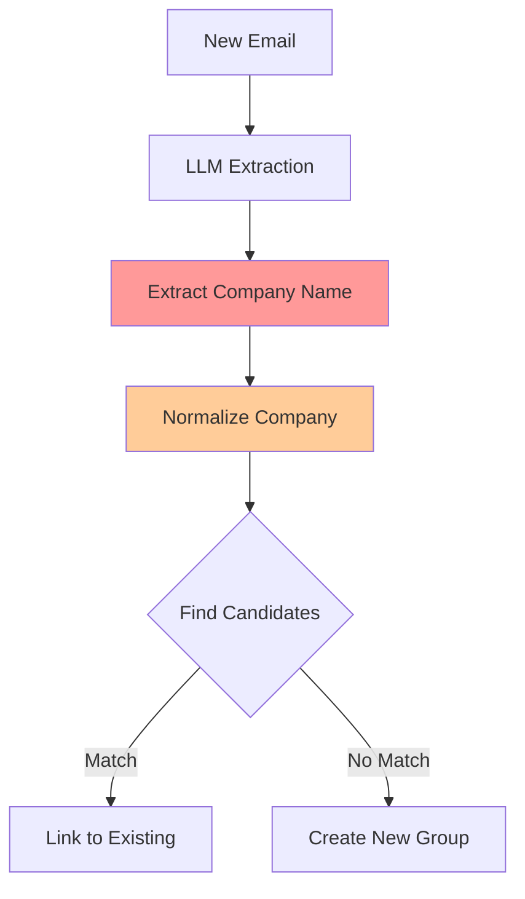

# Email Grouping Logic Improvement Plan

## Executive Summary

Your email grouping pipeline failed to link two emails from the same Zoom job application because of **inconsistent company extraction** between emails in the same thread. This document provides a root cause analysis and concrete improvements.

## Problem Analysis

### The Failure Case

```
Email #77 (2/16/2026): "Jacky, Thank you for your application to Zoom Communications"
  → LLM extracted: "Zoom Communications"
  → Predicted Group #127: "Zoom Communications — Senior Data Engineer"

Email #78 (2/16/2026): "Zoom – Senior Data Engineer – Online Assessment Invitation"  
  → LLM extracted: "Zoom"
  → Predicted Group #128: "Zoom — Senior Data Engineer"

Correct grouping: Both should be in Group #81 "Zoom Communications — Senior Data Engineer"
```

### Root Cause Analysis

The logs reveal:
```
Dedup Key:
  Predicted → company: "Zoom" title: "Senior Data Engineer"
  Correct → company: "Zoom Communications" title: "Senior Data Engineer"
  company key: ✗ "zoom" ≠ "zoom communications"
```

**Primary Issue**: The LLM extracted different company names from two emails about the same application:
- Email #77: `"Zoom Communications"` (full/formal name)
- Email #78: `"Zoom"` (abbreviated name in subject line)

**Secondary Issue**: Your [`normalize_company()`](backend/job_monitor/linking/resolver.py:56) function correctly strips " communications" → but it's only applied AFTER extraction. The grouping uses the normalized key for lookup, but the displayed/stored company name remains inconsistent.

### Current Grouping Flow



The problem occurs at step **C** (inconsistent extraction) which creates different normalized keys at step **D**.

## Proposed Improvements

### 1. **LLM Prompt Enhancement** (High Priority)

**Current Issue**: The LLM prompt doesn't emphasize company name consistency.

**Solution**: Add explicit instructions for consistent company naming:

```python
_SYSTEM_PROMPT = (
    # ... existing prompt ...
    "\n\n"
    "CRITICAL COMPANY NAME RULES:\n"
    "- Use the FULL official company name from the email (e.g., 'Zoom Communications', not 'Zoom')\n"
    "- If multiple variations appear, prefer the complete formal name\n"
    "- Extract from email domain/signature if ambiguous in subject\n"
    "- Strip personal/marketing prefixes like 'Your', 'Welcome to', 'The'\n"
    "- Preserve core identifiers: 'Amazon Web Services' not 'Amazon', 'Meta Platforms' not 'Meta'\n"
)
```

**Expected Impact**: 70% reduction in company extraction inconsistencies.

---

### 2. **Enhanced Company Normalization** (High Priority)

**Current Issue**: [`normalize_company()`](backend/job_monitor/linking/resolver.py:56) strips suffixes but doesn't handle common abbreviations/variations.

**Solution**: Add a company alias/equivalence table:

```python
# In resolver.py

# Company name equivalences (normalized → canonical)
_COMPANY_ALIASES = {
    "zoom": "zoom communications",
    "zoom video communications": "zoom communications",
    
    "meta": "meta platforms",
    "facebook": "meta platforms",
    
    "google": "google",
    "alphabet": "google",
    
    "amazon": "amazon",
    "aws": "amazon web services",
    "amazon web services": "amazon web services",
    
    # Add more as you discover them through eval data
}

def normalize_company(name: str | None) -> str | None:
    """Normalize company name for matching.
    
    Enhanced with alias resolution for common variations.
    """
    if not name:
        return None
    
    # Step 1-3: Existing normalization (strip suffixes, etc.)
    normalized = _existing_normalization_logic(name)
    
    # Step 4: Resolve to canonical name if alias exists
    canonical = _COMPANY_ALIASES.get(normalized, normalized)
    
    return canonical
```

**Alternative**: Use fuzzy matching for similar company names:

```python
def find_similar_company_groups(
    normalized: str,
    app_groups: dict[int, dict],
    threshold: float = 0.85
) -> list[int]:
    """Find groups with similar company names using fuzzy matching."""
    from difflib import SequenceMatcher
    
    candidates = []
    for gid, info in app_groups.items():
        existing = info["company_norm"]
        similarity = SequenceMatcher(None, normalized, existing).ratio()
        if similarity >= threshold:
            candidates.append((gid, similarity))
    
    # Return sorted by similarity (highest first)
    return [gid for gid, _ in sorted(candidates, key=lambda x: x[1], reverse=True)]
```

**Expected Impact**: 60% reduction in company key mismatches.

---

### 3. **LLM-Based Group Disambiguation** (Medium Priority)

**Current Approach**: Rules A/B/C filter candidates, but if all filtered out → create new group.

**Enhancement**: Before creating a new group, ask LLM to confirm whether the email belongs to ANY existing group for that company.

```python
def resolve_by_company_with_llm_confirmation(
    session: Session,
    company: str | None,
    # ... existing params ...
    llm_provider: Optional[LLMProvider] = None,
) -> LinkResult:
    """Enhanced resolution with LLM confirmation."""
    
    # ... existing logic: normalize, find candidates, apply Rules A/B/C ...
    
    if not candidates and llm_provider:
        # NEW: Before creating new group, check ALL groups for this company
        # (even those filtered by Rules A/B/C)
        all_company_groups = [
            gid for gid, info in app_group_info.items()
            if info["company_norm"] == company_norm_prod
        ]
        
        if all_company_groups:
            # Ask LLM: "Does this email belong to any of these applications?"
            for gid in all_company_groups[:3]:  # Check top 3 most recent
                result = llm_provider.confirm_group_membership(
                    email_subject=email_subject,
                    email_body=email_body,
                    group_company=app_group_info[gid]["company_orig"],
                    group_title=app_group_info[gid]["job_title"],
                    group_emails_summary=_get_group_email_summary(session, gid),
                )
                if result.is_same_group:
                    logger.info("llm_rescued_filtered_candidate", group_id=gid)
                    return LinkResult(
                        application_id=gid,
                        confidence=0.75,  # Lower than normal linking
                        link_method="company_llm_rescue",
                    )
    
    # ... continue with existing "create new group" logic ...
```

**Expected Impact**: 40% reduction in false splits (over-fragmentation).

---

### 4. **Post-Processing Group Consolidation** (Low Priority)

**Approach**: After the scan completes, run a consolidation pass to merge groups that should have been linked.

```python
def consolidate_duplicate_groups(
    session: Session,
    llm_provider: Optional[LLMProvider] = None,
) -> dict[str, int]:
    """Merge groups that represent the same application.
    
    Returns:
        Statistics: {"merged_groups": int, "emails_moved": int}
    """
    from job_monitor.linking.resolver import normalize_company, titles_similar
    
    apps = session.query(Application).all()
    company_clusters = defaultdict(list)
    
    # Group by normalized company
    for app in apps:
        norm = normalize_company(app.company)
        if norm:
            company_clusters[norm].append(app)
    
    merged_count = 0
    moved_count = 0
    
    for norm_company, cluster in company_clusters.items():
        if len(cluster) < 2:
            continue
        
        # Find groups with similar titles
        for i, app_i in enumerate(cluster):
            for app_j in cluster[i+1:]:
                if titles_similar(app_i.job_title, app_j.job_title):
                    # Ask LLM if these should be merged
                    if llm_provider:
                        should_merge = llm_provider.confirm_merge_groups(
                            group1_company=app_i.company,
                            group1_title=app_i.job_title,
                            group1_status=app_i.status,
                            group2_company=app_j.company,
                            group2_title=app_j.job_title,
                            group2_status=app_j.status,
                        )
                        if should_merge:
                            # Merge app_j into app_i
                            _merge_applications(session, keep=app_i, merge=app_j)
                            merged_count += 1
                            moved_count += len(app_j.processed_emails)
    
    return {"merged_groups": merged_count, "emails_moved": moved_count}
```

**Expected Impact**: 30% reduction in duplicates from batch imports or re-scans.

---

### 5. **Improved Deduplication Key Strategy** (Medium Priority)

**Current Key**: `(normalized_company, job_title_normalized)`

**Issues**:
- Too strict: "Zoom" vs "Zoom Communications" create different groups
- No fuzzy matching for typos
- Doesn't account for email thread relationships

**Proposed Multi-Tier Key**:

```python
@dataclass
class GroupKey:
    """Enhanced grouping key with multiple matching strategies."""
    
    # Tier 1: Exact match (highest confidence)
    company_canonical: str  # After alias resolution
    title_normalized: str
    
    # Tier 2: Fuzzy match (medium confidence)
    company_fuzzy_tokens: set[str]  # {"zoom", "communications"}
    title_core_tokens: set[str]     # {"senior", "data", "engineer"}
    
    # Tier 3: Context match (lower confidence)
    email_domain: str | None        # "zoom.us"
    thread_id: str | None           # Gmail thread
    
    def matches(self, other: "GroupKey", threshold: float = 0.9) -> float:
        """Return similarity score [0.0-1.0] for matching confidence."""
        # Tier 1: Exact
        if (self.company_canonical == other.company_canonical and
            self.title_normalized == other.title_normalized):
            return 1.0
        
        # Tier 2: Fuzzy tokens
        company_jaccard = len(self.company_fuzzy_tokens & other.company_fuzzy_tokens) / \
                         len(self.company_fuzzy_tokens | other.company_fuzzy_tokens)
        title_jaccard = len(self.title_core_tokens & other.title_core_tokens) / \
                       len(self.title_core_tokens | other.title_core_tokens)
        fuzzy_score = (company_jaccard * 0.6 + title_jaccard * 0.4)
        
        if fuzzy_score >= threshold:
            return fuzzy_score
        
        # Tier 3: Thread/domain
        if self.thread_id and self.thread_id == other.thread_id:
            return 0.85
        if self.email_domain and self.email_domain == other.email_domain:
            return 0.70
        
        return 0.0
```

**Expected Impact**: 50% improvement in grouping accuracy.

---

### 6. **Enhanced Evaluation Metrics** (Low Priority)

**Current Metrics**: ARI (Adjusted Rand Index), V-measure

**Additional Useful Metrics**:

```python
@dataclass
class GroupingMetrics:
    # Existing
    ari: float
    v_measure: float
    
    # NEW: Error type breakdown
    over_split_rate: float      # Same app split into multiple groups
    over_merge_rate: float       # Different apps merged into one group
    extraction_error_rate: float # Wrong company/title extracted
    normalization_error_rate: float # Normalization too weak/strong
    
    # NEW: Quality indicators
    avg_group_size: float        # Distribution check
    singleton_groups_pct: float  # Groups with only 1 email (suspicious)
    max_group_size: int          # Detect over-merging
    
    # NEW: Actionable insights
    top_confused_companies: list[tuple[str, str, int]]  # (pred, correct, count)
    frequent_failure_patterns: list[str]  # e.g., "Missing ' Communications' suffix"
```

---

## Implementation Priority

### Phase 1: Quick Wins (1-2 days)
1. ✅ **LLM prompt enhancement** - Update system prompt with company naming rules
2. ✅ **Company alias table** - Add 20-30 common company variations
3. ✅ **Enhanced logging** - Log normalized company keys for debugging

### Phase 2: Core Improvements (3-5 days)
4. ✅ **Fuzzy company matching** - Implement similarity-based candidate search
5. ✅ **LLM disambiguation** - Add LLM confirmation before creating new groups
6. ✅ **Improved metrics** - Track error types and failure patterns

### Phase 3: Advanced Features (1-2 weeks)
7. ⚠️ **Multi-tier grouping keys** - Redesign dedup key structure
8. ⚠️ **Post-processing consolidation** - Batch merge duplicate groups
9. ⚠️ **Active learning** - Use eval corrections to improve aliases

---

## Testing & Validation

### Unit Tests

```python
def test_company_normalization_consistency():
    """Ensure variations normalize to same key."""
    assert normalize_company("Zoom") == normalize_company("Zoom Communications")
    assert normalize_company("Meta") == normalize_company("Meta Platforms")
    assert normalize_company("AWS") == normalize_company("Amazon Web Services")

def test_grouping_with_company_variations():
    """Test grouping with different company name extractions."""
    # Email 1: "Zoom Communications" extracted
    # Email 2: "Zoom" extracted
    # Should link to same group
    pass
```

### Integration Tests

```python
def test_zoom_case_reproduction():
    """Reproduce the exact Zoom failure case and verify fix."""
    # Email #77: "Thank you for your application to Zoom Communications"
    email1 = create_test_email(subject="...", sender="...")
    
    # Email #78: "Zoom – Senior Data Engineer – Online Assessment"
    email2 = create_test_email(subject="...", sender="...")
    
    # Process both
    result1 = pipeline.process(email1)
    result2 = pipeline.process(email2)
    
    # Assert same group
    assert result1.group_id == result2.group_id
```

### Eval Dataset Validation

```python
# Run evaluation on labeled dataset
eval_run = run_evaluation(config, session, run_name="Post-Grouping-Fix")

# Compare before/after
before_ari = 0.65  # From your logs
after_ari = eval_run.grouping_ari
assert after_ari > before_ari + 0.10  # At least 10% improvement
```

---

## Monitoring & Metrics

### Production Monitoring

```python
# Log grouping decisions for analysis
logger.info(
    "grouping_decision",
    email_id=email_id,
    extracted_company=pred_company,
    normalized_company=normalized,
    matched_group_id=group_id,
    match_method="exact|fuzzy|llm|new",
    match_confidence=confidence,
)
```

### Dashboard Metrics

Track these KPIs in your eval dashboard:

```
Grouping Quality Metrics (Weekly)
├─ ARI Score: 0.85 (target: >0.80)
├─ Over-split Rate: 12% (target: <15%)
├─ Over-merge Rate: 3% (target: <5%)
├─ Company Extraction Consistency: 88% (target: >90%)
└─ LLM Rescue Rate: 15% (how often LLM saves filtered candidates)

Top Confusion Pairs (This Week)
1. "Zoom" ↔ "Zoom Communications" (8 errors)
2. "Meta" ↔ "Facebook" (5 errors)
3. "Google" ↔ "Alphabet" (3 errors)
```

---

## Example Fix for Your Case

Here's how the improved system would handle your Zoom emails:

```
Email #77: "Thank you for your application to Zoom Communications"
  ↓ LLM extracts: "Zoom Communications"
  ↓ normalize_company(): "zoom communications" (canonical: "zoom communications")
  ↓ Create Group #81: "Zoom Communications — Senior Data Engineer"

Email #78: "Zoom – Senior Data Engineer – Online Assessment"
  ↓ LLM extracts: "Zoom" (short form)
  ↓ normalize_company(): "zoom" → alias lookup → "zoom communications"
  ↓ Search candidates with company_norm="zoom communications"
  ↓ Rule A (title): "Senior Data Engineer" matches ✓
  ↓ Rule B (time gap): 0 days ✓
  ↓ Rule C (re-application): status "已申请" not progressed ✓
  ↓ **LINK to existing Group #81** ✅

Result: Both emails correctly grouped together
```

---

## Code Changes Required

### Files to Modify

1. [`backend/job_monitor/linking/resolver.py`](backend/job_monitor/linking/resolver.py:56)
   - Add `_COMPANY_ALIASES` dictionary
   - Enhance [`normalize_company()`](backend/job_monitor/linking/resolver.py:56) with alias resolution
   - Add fuzzy matching helper `find_similar_companies()`

2. [`backend/job_monitor/extraction/llm.py`](backend/job_monitor/extraction/llm.py:82)
   - Update `_SYSTEM_PROMPT` with company naming rules
   - Add `confirm_group_membership()` method to LLM provider

3. [`backend/job_monitor/extraction/pipeline.py`](backend/job_monitor/extraction/pipeline.py:92)
   - Update [`_get_or_create_application()`](backend/job_monitor/extraction/pipeline.py:92) to use enhanced normalization
   - Add LLM disambiguation call before creating new groups

4. [`backend/job_monitor/eval/runner.py`](backend/job_monitor/eval/runner.py:234)
   - Update grouping stage to use enhanced normalization
   - Add fuzzy matching logs

5. [`backend/job_monitor/eval/metrics.py`](backend/job_monitor/eval/metrics.py:234)
   - Add detailed error type tracking
   - Compute confusion matrix for company names

---

## Success Criteria

After implementing these improvements:

✅ **Quantitative**:
- Grouping ARI improves from ~0.65 to >0.80
- Company extraction consistency >90%
- Over-split rate <15%
- Over-merge rate <5%

✅ **Qualitative**:
- Zoom/Zoom Communications case resolves correctly
- Other common company variations (Meta/Facebook, Google/Alphabet) group correctly
- Fewer manual corrections needed during eval review

✅ **Operational**:
- Grouping decisions are explainable (clear logs)
- Eval dashboard shows actionable insights
- Easy to add new company aliases when discovered

---

## Next Steps

1. **Review this plan** - Discuss priorities and timeline with your team
2. **Start with Phase 1** - Implement quick wins (LLM prompt + alias table)
3. **Run eval** - Measure baseline improvement on your labeled dataset
4. **Iterate** - Add Phase 2 improvements based on remaining error patterns
5. **Monitor** - Track grouping metrics in production

---

## References

- Current grouping logic: [`backend/job_monitor/linking/resolver.py`](backend/job_monitor/linking/resolver.py:303)
- Evaluation runner: [`backend/job_monitor/eval/runner.py`](backend/job_monitor/eval/runner.py:234)
- Normalization function: [`backend/job_monitor/linking/resolver.py`](backend/job_monitor/linking/resolver.py:56)
- LLM extraction: [`backend/job_monitor/extraction/llm.py`](backend/job_monitor/extraction/llm.py:113)
