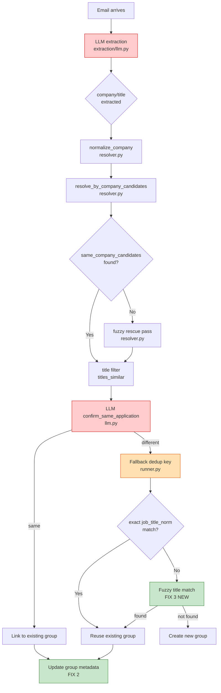

# Linking Logic Improvement Plan

## The Failure Case: Grafana Labs / Senior Data Engineer

```
[email]    Email received: 2/27/2026, 11:23:59 AM
[company]  [Run #72] "Grafana Labs" → "Grafana"
[job_title][Run #72] "Senior Data Engineer" → "Senior Data Engineer | USA | Remote"
[grouping] Decision: NEW_GROUP_CREATED
[grouping] Predicted: #663 "Grafana Labs — Senior Data Engineer" (size 3)
[grouping] Correct:   #630 "Grafana — Senior Data Engineer | USA | Remote" (size 1)
[grouping] Cluster match: ✓ same cluster
[grouping] company key: ✓ same  |  title key: ✓ same
[grouping] No other labeled emails in this group yet (cluster size = 1)
```

---

## End-to-End Failure Trace

### What the system did

```
Email arrives (2/27/2026, Grafana job update)
  ↓
LLM extraction:
  company  = "Grafana Labs"       ← should be "Grafana"
  title    = "Senior Data Engineer" ← should be "Senior Data Engineer | USA | Remote"
  ↓
normalize_company("Grafana Labs") = "grafana"   ✓  correct
_normalize_title("Senior Data Engineer")        = "senior data engineer"  ← too short
  ↓
resolve_by_company_candidates() called
  same_company_candidates: any group in app_group_info with company_norm == "grafana"
    → finds group #663 (2 prior emails already placed there)
  titles_similar("Senior Data Engineer", "Senior Data Engineer") = True
  LLM confirmation called:
    app_company  = "Grafana Labs"  (raw stored form)
    new_title    = "Senior Data Engineer"
    candidate_title = "Senior Data Engineer"
    → LLM says SAME  (or: falls back to dedup key path)
  → pred_group_id = #663  (size goes from 2 → 3)
  ↓
Eval compares:
  predicted group #663 ← contains 3 emails  ← some belong to OTHER correct groups
  correct  group #630  ← "Senior Data Engineer | USA | Remote"
  → MERGE ERROR: #663 has emails from ≥ 2 different true application groups
  → grouping_correct = False
```

### Why the dedup key causes the merge

The eval runner's fallback dedup key path (when resolver declines OR for the first email):

```python
# runner.py line ~489
title_norm_for_key = (pred_title or "").strip().lower()
existing_group = session.query(EvalPredictedGroup).filter(
    EvalPredictedGroup.eval_run_id == eval_run.id,
    EvalPredictedGroup.company_norm == company_norm_prod,
    EvalPredictedGroup.job_title_norm == title_norm_for_key,   # ← EXACT match
).first()
```

| Email # | Extracted title | title_norm_for_key | Dedup match |
|---------|----------------|-------------------|-------------|
| 1 | "Senior Data Engineer" | "senior data engineer" | → creates #663 |
| 2 | "Senior Data Engineer" | "senior data engineer" | → reuses #663 |
| 3 (this) | "Senior Data Engineer" | "senior data engineer" | → reuses #663 |

All three end up in `#663`, even if emails 1 and 2 belong to **different** Grafana applications (e.g., one from 2025, one from 2026, or different teams). The short title is too broad to distinguish them.

---

## Root Causes (Ordered by Impact)

### Root Cause 1 — LLM drops title location/mode qualifiers [CRITICAL]

**File**: [`backend/job_monitor/extraction/llm.py`](backend/job_monitor/extraction/llm.py:173)

The LLM extracts `"Senior Data Engineer"` but the canonical title is `"Senior Data Engineer | USA | Remote"`. The `| USA | Remote` suffix is dropped during extraction. This makes the extracted title LESS SPECIFIC than the real role identifier.

**Impact**: The dedup key `("grafana", "senior data engineer")` is too broad — it matches emails from any Grafana Data Engineer role regardless of location or level variant.

---

### Root Cause 2 — Dedup key fallback uses exact title match [HIGH]

**File**: [`backend/job_monitor/eval/runner.py`](backend/job_monitor/eval/runner.py:489)

The eval runner's fallback dedup key path uses `job_title_norm == title_norm_for_key` (exact string equality). This means:
- `"senior data engineer"` ≠ `"senior data engineer | usa | remote"`
- Two emails for the SAME role (one with full title, one without) get placed in **different** predicted groups
- Conversely, emails for DIFFERENT roles (both just "Senior Data Engineer") get merged into the SAME predicted group

**Impact**: Incorrect splits and merges in grouping metrics.

---

### Root Cause 3 — LLM confirmation sees raw company name variants [MEDIUM]

**File**: [`backend/job_monitor/extraction/llm.py`](backend/job_monitor/extraction/llm.py:357)

In `confirm_same_application()`, the user prompt passes:
```
Existing Application:
- Company: Grafana Labs       ← raw stored form
New Email:
- Body: "...at Grafana..."    ← email mentions just "Grafana"
```

The LLM sees `"Grafana Labs"` in the existing record and `"Grafana"` in the new email, and may treat this as evidence of different companies — even though `normalize_company()` already confirmed they match. The LLM is making a decision AFTER normalization has already matched them, but it doesn't know that.

**Impact**: LLM confirmation may incorrectly return `"different"` when company names are slightly different variants of the same company, causing the resolver to decline a valid link.

---

### Root Cause 4 — Group stores extracted title; overwrites with shorter form [MEDIUM]

**File**: [`backend/job_monitor/eval/runner.py`](backend/job_monitor/eval/runner.py:479)

When linking an email to an existing group, the runner unconditionally overwrites the group's stored title:
```python
if pred_title:
    app_group_info[pred_group_id]["job_title"] = pred_title  # always overwrites
```

If email 1 correctly extracted `"Senior Data Engineer | USA | Remote"` and email 2 extracts just `"Senior Data Engineer"`, the group's stored title degrades to the shorter form. Subsequent lookups by the dedup key then lose the qualifier.

**Impact**: Once degraded, the dedup key broadens and later merges unrelated emails.

---

### Root Cause 5 — Production `_get_or_create_application` uses exact title match [MEDIUM]

**File**: [`backend/job_monitor/extraction/pipeline.py`](backend/job_monitor/extraction/pipeline.py:126)

When the resolver declines to link (falls through to creating/updating an Application), the dedup check uses exact title equality:
```python
existing = _base_q().filter(Application.job_title == job_title, ...).first()
```

`"Senior Data Engineer"` ≠ `"Senior Data Engineer | USA | Remote"` → creates a **duplicate Application** record.

**Impact**: Two Application rows exist for the same job, causing split grouping in production.

---

## Improvements (Ordered by Priority)

---

### Improvement 1 — Preserve title location/mode qualifiers in LLM extraction

**File**: [`backend/job_monitor/extraction/llm.py`](backend/job_monitor/extraction/llm.py:173)  
**Priority**: P0 (fixes root cause 1 — prevents the problem upstream)

#### Current prompt (line ~173):
```python
"- job_title: a specific role name (e.g., 'Software Engineer', 'Product Manager'). "
"Extract from the email body first, then subject as fallback. "
"Include team/department qualifiers and job IDs when present..."
```

#### Add after `TITLE COMPLETENESS RULES` block:
```python
"  * Preserve location and work-mode qualifiers when they appear as part of the\n"
"    official title (e.g., 'Senior Data Engineer | USA | Remote',\n"
"    'Software Engineer – New York – Hybrid'). Do NOT strip suffixes after '|',\n"
"    '–', or '/' if they distinguish this posting from another at the same company.\n"
"  * If the subject uses a short form ('Senior Data Engineer') but the email body\n"
"    uses a full form ('Senior Data Engineer | USA | Remote'), always use the full\n"
"    form from the body.\n"
```

#### Expected outcome:
```
Before: extracted title = "Senior Data Engineer"
After:  extracted title = "Senior Data Engineer | USA | Remote"
```
The dedup key becomes `("grafana", "senior data engineer | usa | remote")`, which is specific enough to distinguish different postings at the same company.

---

### Improvement 2 — Prefer the more specific title when updating a group

**File**: [`backend/job_monitor/eval/runner.py`](backend/job_monitor/eval/runner.py:475)  
**Priority**: P1 (prevents title degradation even when extraction is imperfect)

#### Current code (lines 475–486):
```python
if pred_company:
    app_group_info[pred_group_id]["company_orig"] = pred_company
if pred_title:
    app_group_info[pred_group_id]["job_title"] = pred_title   # always overwrites
```

#### Proposed change:
```python
if pred_company:
    existing_orig = app_group_info[pred_group_id].get("company_orig", "")
    # Prefer the SHORTER (more canonical) company name when both normalize the same
    if not existing_orig or len(pred_company) < len(existing_orig):
        app_group_info[pred_group_id]["company_orig"] = pred_company
        app_group_info[pred_group_id]["company_norm"] = (
            _prod_normalize_company(pred_company) or app_group_info[pred_group_id]["company_norm"]
        )

if pred_title:
    existing_title = app_group_info[pred_group_id].get("job_title", "")
    # Prefer the LONGER (more specific) title — it contains more disambiguation signal
    if not existing_title or len(pred_title) > len(existing_title):
        app_group_info[pred_group_id]["job_title"] = pred_title
```

**Same logic** should be applied when the resolver links via the shared-result path (line ~466).

**For company**: shorter is more canonical ("Grafana" < "Grafana Labs").  
**For title**: longer is more specific ("Senior Data Engineer | USA | Remote" > "Senior Data Engineer").

---

### Improvement 3 — Fuzzy title matching in the dedup key fallback

**File**: [`backend/job_monitor/eval/runner.py`](backend/job_monitor/eval/runner.py:488)  
**Priority**: P1 (prevents incorrect splits when same role has minor title variations)

#### Current code:
```python
title_norm_for_key = (pred_title or "").strip().lower()
existing_group = session.query(EvalPredictedGroup).filter(
    EvalPredictedGroup.eval_run_id == eval_run.id,
    EvalPredictedGroup.company_norm == company_norm_prod,
    EvalPredictedGroup.job_title_norm == title_norm_for_key,   # exact
).first()
```

#### Proposed change:
```python
from job_monitor.linking.resolver import _normalize_title, titles_similar

# Step 1: exact match (fast path — use normalized title for consistency)
title_norm_for_key = _normalize_title(pred_title or "")
existing_group = session.query(EvalPredictedGroup).filter(
    EvalPredictedGroup.eval_run_id == eval_run.id,
    EvalPredictedGroup.company_norm == company_norm_prod,
    EvalPredictedGroup.job_title_norm == title_norm_for_key,
).first()

# Step 2: fuzzy match (catches "Senior Data Engineer" ≈ "Senior Data Engineer | USA | Remote")
if not existing_group and pred_title:
    same_co_groups = session.query(EvalPredictedGroup).filter(
        EvalPredictedGroup.eval_run_id == eval_run.id,
        EvalPredictedGroup.company_norm == company_norm_prod,
    ).all()
    for pg in same_co_groups:
        if titles_similar(pred_title, pg.job_title or ""):
            existing_group = pg
            dstep("grouping", f"Fuzzy title match found existing group #{pg.id} "
                  f"({pred_title!r} ≈ {pg.job_title!r})", "info")
            break
```

**Guard**: Only use the fuzzy match result if it's within the same company_norm. The `titles_similar()` threshold (0.9 Jaccard + asymmetric 0.8 coverage + role anchor) is already strict enough to avoid false positives across different roles.

Also update `EvalPredictedGroup.job_title_norm` to use `_normalize_title()` instead of `.lower()` when creating:
```python
pred_group = EvalPredictedGroup(
    ...
    job_title_norm=_normalize_title(pred_title or ""),   # was: (pred_title or "").strip().lower()
)
```

---

### Improvement 4 — Tell LLM that company names are already normalized

**File**: [`backend/job_monitor/extraction/llm.py`](backend/job_monitor/extraction/llm.py:288)  
**Priority**: P2 (prevents false DIFFERENT decisions from minor brand name variants)

#### Current `_LINK_CONFIRM_PROMPT`:
```python
_LINK_CONFIRM_PROMPT = (
    "You are matching job application emails. Determine if a new email "
    "is about the SAME job application as an existing record, or a DIFFERENT one.\n\n"
    ...
    "2) Prefer DIFFERENT only with strong new-application evidence such as:\n"
    "   - conflicting req_id values,\n"
    "   - clearly different role title,\n"
    ...
```

#### Add to the Decision Policy section:
```python
"5) Company names have ALREADY been normalized and matched by the system.\n"
"   If you see similar company names like 'Grafana' vs 'Grafana Labs', "
"'Zoom' vs 'Zoom Communications', or 'Google' vs 'Google LLC', treat them as\n"
"   THE SAME COMPANY. Do NOT use minor brand-name variants as evidence of DIFFERENT.\n"
```

#### Also in the user prompt `confirm_same_application()`, add explicit normalization note when the company names differ:
```python
# In resolver.py _confirm_candidate(), compute and pass this note
incoming_norm = normalize_company(new_title_company or "") or ""
candidate_norm = normalize_company(candidate.company or "") or ""
company_note = ""
if incoming_norm == candidate_norm and candidate.company != (new_title_company or ""):
    company_note = (
        f"\nNote: '{candidate.company}' and the company in this email are considered "
        f"equivalent by normalization (both → '{incoming_norm}'). "
        f"Do not use the name difference as evidence of DIFFERENT.\n"
    )
```

Then pass `company_note` into the user_prompt built in `confirm_same_application()`, inserting it in the "Existing Application" block.

Since `confirm_same_application()` is a Protocol method, the cleanest approach is to add this note directly inside the `OpenAIProvider.confirm_same_application()` implementation by computing it from `app_company` and whatever company name appears in the email body, or by adding a new optional `company_norm_match: bool = False` parameter to the Protocol.

Alternatively — simpler — pass the **normalized** company name in `app_company` instead of the raw stored form:

```python
# In resolver.py _confirm_candidate():
return _confirm_same_application_with_timeline(
    llm_provider,
    ...
    app_company=normalize_company(candidate.company) or candidate.company,  # ← normalized form
    ...
)
```

This makes the LLM see `"grafana"` instead of `"Grafana Labs"` for the existing application, which matches what it would see in the email body's "Grafana" reference, eliminating the mismatch entirely.

---

### Improvement 5 — Fuzzy title match in `_get_or_create_application`

**File**: [`backend/job_monitor/extraction/pipeline.py`](backend/job_monitor/extraction/pipeline.py:126)  
**Priority**: P2 (prevents duplicate Application rows in production)

#### Current code:
```python
elif job_title:
    existing = (
        _base_q()
        .filter(
            Application.job_title == job_title,   # exact match
            (Application.req_id == None) | (Application.req_id == ""),
        )
        .first()
    )
```

#### Proposed change (no req_id case only — when req_id is absent, title is the only discriminator):
```python
elif job_title:
    # Fetch all same-company apps without req_id, then apply fuzzy title match
    candidates = (
        _base_q()
        .filter((Application.req_id == None) | (Application.req_id == ""))
        .all()
    )
    from job_monitor.linking.resolver import titles_similar
    existing = next(
        (c for c in candidates if titles_similar(job_title, c.job_title or "")),
        None,
    )
```

**When req_id is present**, keep exact match — req_id is already a strong disambiguator and fuzzy title matching adds no value.

When a fuzzy match is found, prefer the **longer** (more specific) title:
```python
if existing and job_title and len(job_title) > len(existing.job_title or ""):
    existing.job_title = job_title  # upgrade to more specific title
```

---

## Summary of Changes

```
File                                    Change
──────────────────────────────────────  ─────────────────────────────────────────────────────
extraction/llm.py (_SYSTEM_PROMPT)      [P0] Add instruction to preserve title location/mode
                                             qualifiers (| USA | Remote, – Hybrid, etc.)

extraction/llm.py (_LINK_CONFIRM_PROMPT)[P2] Tell LLM company names are pre-normalized;
                                             minor variants (Labs, LLC) are not DIFFERENT

extraction/llm.py (confirm_same_application) [P2] Pass normalized company name OR add
resolver.py (_confirm_candidate)             company_norm_note to prompt

eval/runner.py (link fallback ~L489)    [P1] Fuzzy title fallback in dedup key lookup
eval/runner.py (link fallback ~L499)    [P1] Use _normalize_title() for job_title_norm in
                                             EvalPredictedGroup, not raw .lower()

eval/runner.py (update existing ~L475) [P1] Prefer shorter company and longer title
                                             when updating group metadata

extraction/pipeline.py (L126)          [P2] Use titles_similar() for no-req_id dedup
                                             in _get_or_create_application; update to longer
                                             title if found via fuzzy match
```

---

## Mermaid: Where Each Fix Applies in the Pipeline



**Red** = where the root cause originates.  
**Orange** = secondary failure point.  
**Green** = new/improved logic.

---

## Key Invariant After These Fixes

When the same job application generates emails with **slightly different company/title forms** (e.g., "Grafana Labs" vs "Grafana", "Senior Data Engineer" vs "Senior Data Engineer | USA | Remote"), the linking logic will:

1. **At extraction time**: preserve the full title including location qualifiers (Fix 1)
2. **At group metadata update time**: keep the shorter company and longer title as the canonical form (Fix 2)
3. **At dedup key fallback time**: use fuzzy title matching to find existing groups (Fix 3)
4. **At LLM confirmation time**: not be misled by minor company name variants (Fix 4)
5. **At production dedup time**: not create duplicate Application rows for the same role (Fix 5)
