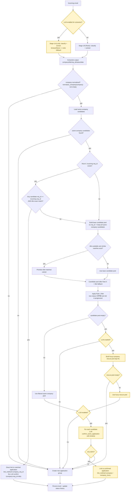

# Linking Workflow v2 (Req-ID Priority + Timeline LLM)

## Scope
This workflow updates application linking/grouping with:
- Req ID exact match as a hard direct-link rule.
- Title fallback when Req ID is missing/unmatched.
- Timeline-aware LLM confirmation for ambiguous candidates and fuzzy rescue.

## Workflow Chart

## Timeline payload sent to `confirm_same_application(...)`
- `new_email_date`
- `app_created_at`
- `app_last_email_date`
- `days_since_last_email`
- `recent_events` (latest 3-5 events, mixed from email + status history)

## Deployment Plan
1. Pre-deploy checks
   - Run targeted tests:
     - `backend/tests/test_recruiter_reach_out_pipeline.py`
     - `backend/tests/test_thread_linking.py` (known legacy failures should be documented if unchanged)
   - Verify no schema migration is required for this specific linking change.
2. Deploy backend
   - Release backend service with updated resolver + LLM confirm prompt/signature.
   - Confirm environment has LLM credentials/timeouts unchanged.
3. Smoke validation in staging
   - Case A: same `req_id` follow-up email links directly (no LLM call).
   - Case B: no `req_id`, same title, same company links through LLM confirm.
   - Case C: rejection then later fresh application with same title is split into new group when timeline indicates new cycle.
   - Case D: fuzzy company variant (e.g., short vs full company name) links via fuzzy rescue + LLM.
4. Production rollout
   - Deploy during low-traffic window.
   - Monitor logs for:
     - `linked_by_company_req_id_exact`
     - `linked_by_company_llm_confirmed`
     - `linked_by_fuzzy_llm_rescue`
     - `company_link_llm_rejected_all`
5. Post-deploy acceptance
   - In review UI, verify job title and req_id are displayed as separate fields.
   - Sample-check re-predict behavior to ensure grouping decisions are recomputed and persisted correctly.
6. Rollback plan
   - Revert backend to previous image/tag.
   - No data migration rollback is needed for this change path.

## Decision Notes
- Req ID equality is treated as strongest identity signal and bypasses LLM.
- Timeline context is used by LLM to distinguish continuation vs new application cycle.
- Title similarity is a prioritization step, not the final authority when LLM is available.
